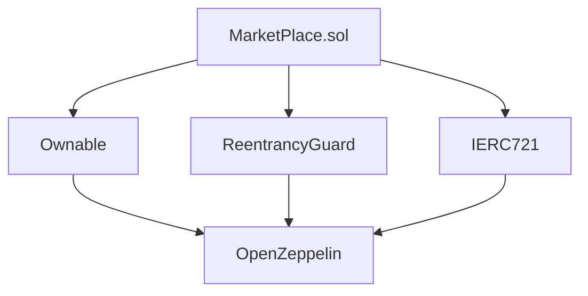
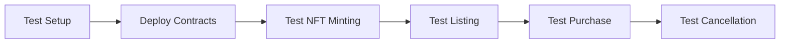

# 🎨 NFT Marketplace

A decentralized NFT marketplace built on Ethereum using Solidity and Foundry. This marketplace provides a secure and efficient platform for trading NFTs with robust security features and a user-friendly interface.

## 📋 Table of Contents
- [Overview](#-overview)
- [Features](#-features)
- [Technical Architecture](#-technical-architecture)
- [Smart Contract Details](#-smart-contract-details)
- [Security Implementation](#-security-implementation)
- [Development Guide](#-development-guide)
- [Testing](#-testing)
- [Usage Guide](#-usage-guide)
- [Contributing](#-contributing)
- [License](#-license)

## 🌟 Overview

The NFT Marketplace is a decentralized application (dApp) that enables users to:
- List their NFTs for sale
- Purchase NFTs from other users
- Manage their listings
- Execute secure transactions

The platform is built with security and efficiency in mind, implementing industry-standard practices and robust security measures.

## 🚀 Features

### Core Functionality
- **NFT Listing System**
  - Set custom prices for NFTs
  - Update listing status
  - View active listings
  - Cancel listings at any time

- **Purchase System**
  - Direct ETH payments
  - Instant NFT transfers
  - Price verification
  - Secure transaction handling

- **Security Features**
  - Reentrancy protection
  - Ownership verification
  - Transaction validation
  - Error handling

## 🏗 Technical Architecture

### Smart Contract Stack


### Contract Dependencies
- **OpenZeppelin Contracts**
  - `Ownable.sol`: Access control
  - `ReentrancyGuard.sol`: Security protection
  - `IERC721.sol`: NFT interface

### Data Structures

#### Listing Structure
```solidity
struct Listing {
    address seller;      // NFT owner's address
    address nftAddress;  // NFT contract address
    uint256 tokenId;     // Unique NFT identifier
    uint256 price;       // Listing price in wei
}
```

#### Storage Mapping
```solidity
mapping (address => mapping(uint256 => Listing)) public listing;
```

## 🔒 Security Implementation

### 1. Reentrancy Protection
```solidity
function buyNFT(address nftAddress_, uint256 tokenId_) 
    external 
    payable 
    nonReentrant 
{
    // Implementation
}
```

### 2. Ownership Verification
```solidity
require(seller == msg.sender, "You are not the owner of this NFT");
```

### 3. Price Validation
```solidity
require(msg.value == listing_.price, "Incorrect price sent");
```

### 4. Secure ETH Transfers
```solidity
(bool sent, ) = listing_.seller.call{ value: msg.value}("");
require(sent, "Failed to send Ether");
```

## 🛠 Development Guide

### Prerequisites
- [Foundry](https://book.getfoundry.sh/getting-started/installation)
- [Node.js](https://nodejs.org/) (v16+ recommended)
- [Git](https://git-scm.com/)

### Environment Setup

1. **Clone the Repository**
   ```bash
   git clone [repository-url]
   cd MarketPlaceBasic
   ```

2. **Install Dependencies**
   ```bash
   forge install
   ```

3. **Build the Project**
   ```bash
   forge build
   ```

### Development Workflow

1. **Create a New Branch**
   ```bash
   git checkout -b feature/your-feature-name
   ```

2. **Make Changes**
   - Implement new features
   - Fix bugs
   - Update documentation

3. **Run Tests**
   ```bash
   forge test
   ```

4. **Submit Pull Request**
   - Create a detailed PR description
   - Include test results
   - Document changes

## 🧪 Testing

### Test Structure


### Running Tests
```bash
# Run all tests
forge test

# Run specific test
forge test --match-test testBuyNFTcorrect

# Run with gas reporting
forge test --gas-report
```

## 📖 Usage Guide

### 1. Listing an NFT

#### Prerequisites
- Own an NFT
- Have sufficient ETH for gas fees

#### Steps
1. Approve the marketplace contract
   ```solidity
   nftContract.approve(marketplaceAddress, tokenId);
   ```

2. Create listing
   ```solidity
   marketplace.listNFT(
       nftAddress,    // Your NFT contract address
       tokenId,       // NFT token ID
       priceInWei     // Price in wei (1 ETH = 1e18 wei)
   );
   ```

### 2. Buying an NFT

#### Prerequisites
- Sufficient ETH balance
- Valid listing exists

#### Steps
1. Verify listing details
   ```solidity
   (address seller, uint256 price) = marketplace.getListing(nftAddress, tokenId);
   ```

2. Execute purchase
   ```solidity
   marketplace.buyNFT{value: price}(nftAddress, tokenId);
   ```

### 3. Canceling a Listing

#### Prerequisites
- Be the owner of the listing

#### Steps
```solidity
marketplace.cancelListing(nftAddress, tokenId);
```

## 🤝 Contributing

We welcome contributions! Please follow these steps:

1. Fork the repository
2. Create your feature branch
3. Commit your changes
4. Push to the branch
5. Create a Pull Request

### Contribution Guidelines
- Follow Solidity style guide
- Write comprehensive tests
- Update documentation
- Provide clear commit messages

## 📄 License

This project is licensed under the MIT License - see the [LICENSE](LICENSE) file for details.


